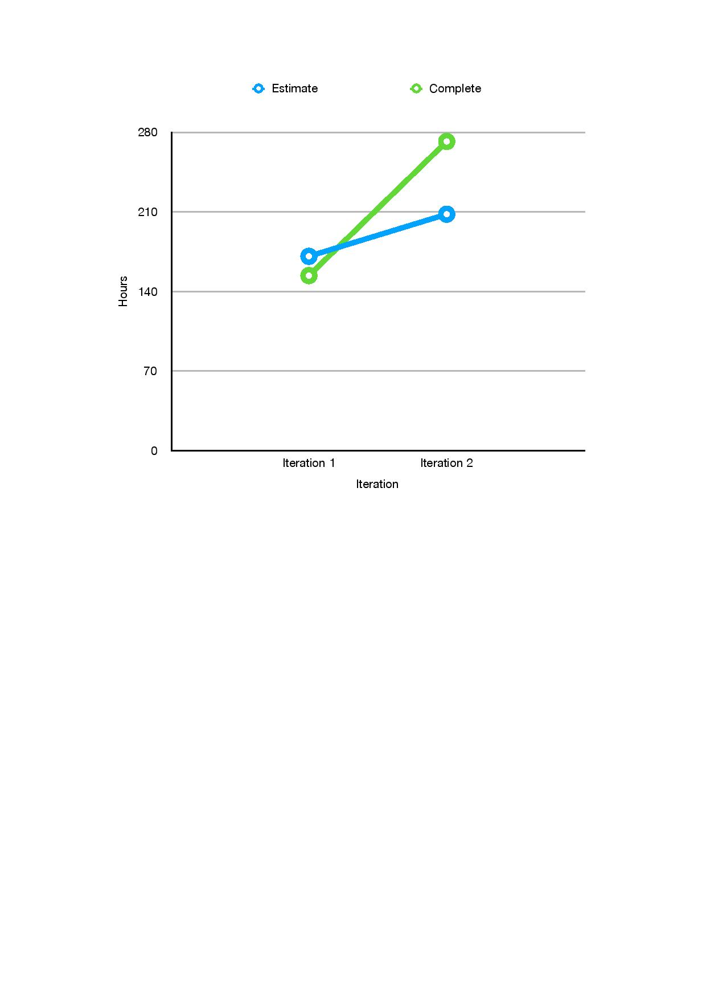

RETROSPECTIVE.md

### From the previous iteration: discuss a part of your project that has not been as successful as you would have liked, and how it can be improved in this iteration

For previous iteration, Planning, process and release part, we did not successful in Documentation and Code smells observed
###### Problem:
(Architectural description is included, but lacks a diagram, or does not fully represent the state of the application)
(issues in GitLab are assigned to a milestone, and then assigned to individual team members)
(unfinished issues are clearly labelled/identified by being moved to a new milestone for iteration 2)
(issues are updated with actual time spent on task to help with future estimation.)
(too complicated logic layer)
(single responsibility principle )
(open/closed principle)
(complex interface hierarchy structure)
###### Solutions
In this iteration, Planning process and release part, we improved Documentation and Code smells observed part. 
As a team, we communication each other much more than previous iteration, we talked about how to improve application, like follow SOLID design principle, like reduce complex structure, make it readable and understandable to each other. 
	we combine and merge file in logic layer, make it clearly and easy understand, check SOLID design principle to our each class, make sure code looks well, remove and combine complex interface to clear way.

### Determine concrete (and realistic) ways of improvement, and decide how its success will be evaluated at the end of the iteration (measurable and objective)

### Also include a chart (as an image) showing the 2 data points of project velocity from the last two iterations. 
For Iteration 1, we estimate time by hours is 171 and we complete it in 154 hours.
For Iteration 2, we estimate time by hours is 208 and we complete it in 272 hours.

